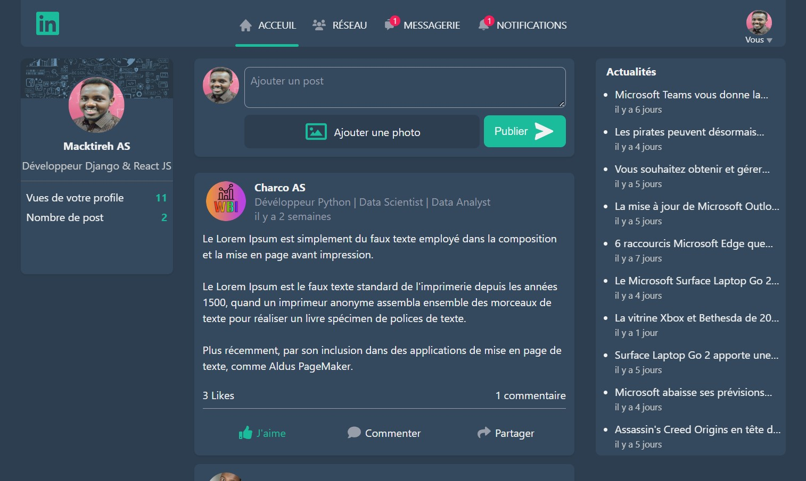

# Mackdin

## Introduction

Mackdin est un projet réseau social (clone Linkedin personnaliser) que j'ai réalisé pour me donner un petit challenge en rentrant du travail le soir et quelques week-ends. Mackdin est construit en Python avec Django et un peu de React js.



**Les technologies utilisés :** 

* Python
* Django
* PostgreSQL
* JavaScript
* React
* HTML
* SASS
* Cloudinary

## Installation

### 1. Pré-requis

Python, NodeJS et Git.

### 2. Cloner le projet

Ouvrer un terminal et exécuter les commandes suivantes:

```bash
git clone https://github.com/Macktireh/mackdin.git
cd mackdin
```

### 3. Créer et activer l'environnement virtual

Créer l'environnement virtual:

```bash
python -m venv .venv
```

Activer l'environnement virtual:

***Pour Windows :***

```bash
.venv\Scripts\activate.bat
```

***Pour Linux et Mac os :***

```bash
source .venv/bin/activate
```

### 4. Installer les dépendances

```bash
pip install -r requirements.txt
```

### 5. Configurer les variables d'environnement

Renommer le fichier .env.example en .env et renseigner vos informations personnelles. 
Puis appliquer les migrations :

```bash
python manage.py migrate
```

Ensuite lancer le server de développement :

```bash
python manage.py runserver
```

Aller sur http://127.0.0.1:8000 dans un navigateur web.
