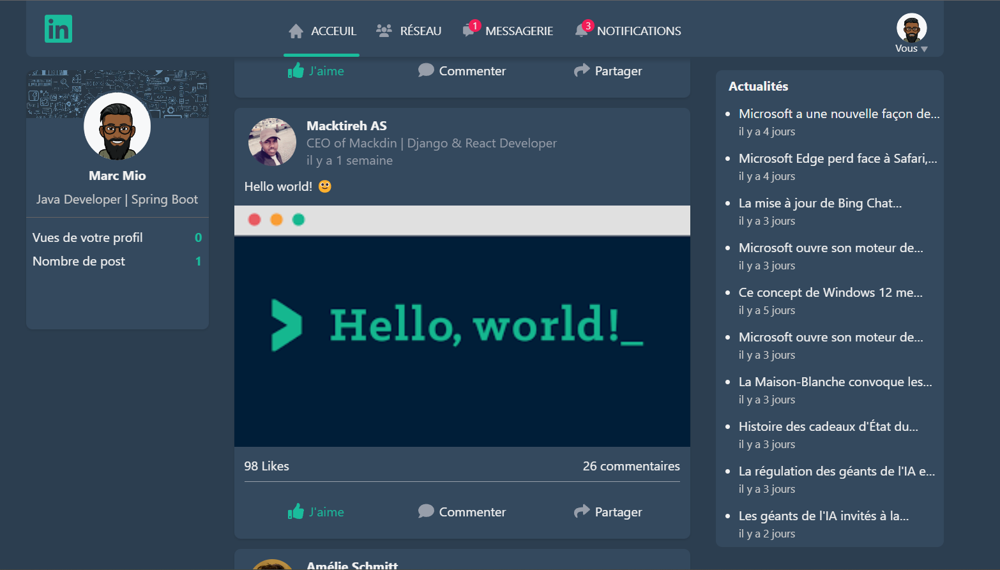
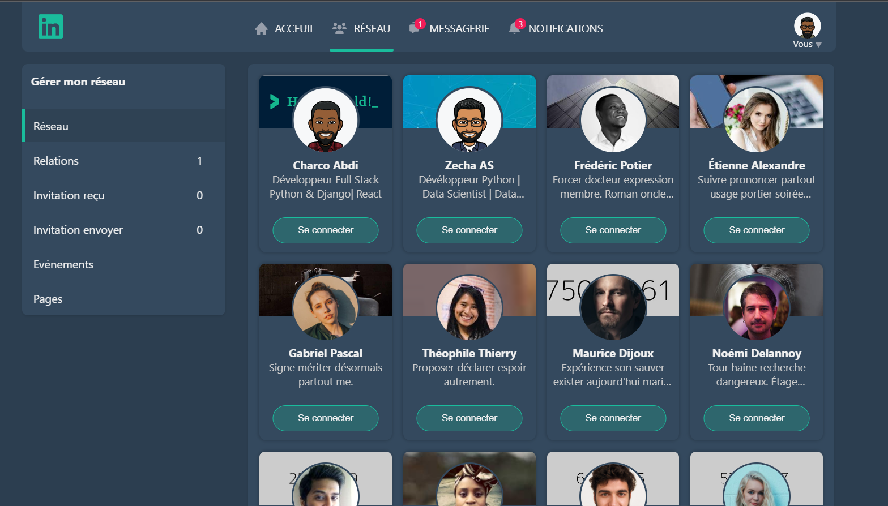
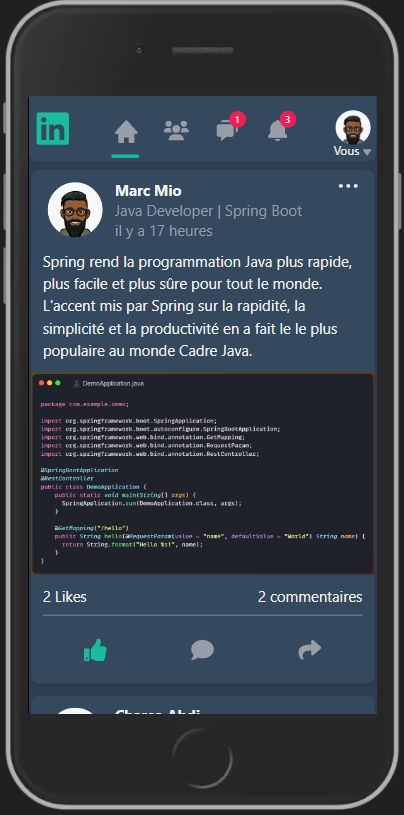
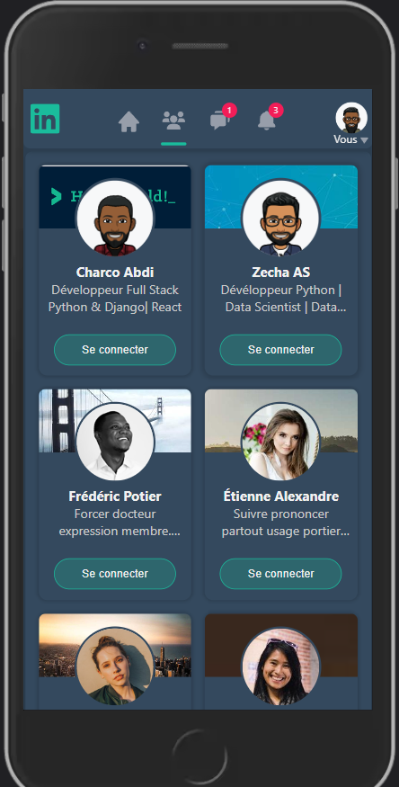

# Mackdin

Mackdin is a social networking project I created using Python with Django and a bit of React. It's a customized clone of LinkedIn.

  <!-- <table>
    <tr>
      <td>
        
      </td>
      <td>
        
      </td>      
    </tr>   
    <tr>
      <td>
        
      </td>
      <td>
        
      </td>      
    </tr>   
</table> -->

 


<!--


 -->

**Here are the technologies I used:**

- Python
- Django
- PostgreSQL
- JavaScript
- React
- SASS
- Cloudinary

## Installation

### 1. Prerequisites

Python 3.10+, NodeJS and Git.

### 2. Clone project

Open a terminal and run the following commands:

```bash
git clone https://github.com/Macktireh/mackdin.git
cd mackdin
```

### 3. Create and activate the virtual environment

Create the virtual environment:

```bash
python -m venv .venv
```

Activate the virtual environment :

**_For Windows :_**

```bash
.venv\Scripts\activate
```

**_For Linux and Mac os :_**

```bash
source .venv/bin/activate
```

### 4. Installing dependencies

```bash
pip install -r requirements.txt
```

### 5. Setting environment variables

Rename the .env.example file to .env and enter your personal information.
Then apply the migrations :

```bash
python manage.py migrate
```

Then launch the development server :

```bash
python manage.py runserver
```

Go to http://127.0.0.1:8000 in a web browser.
